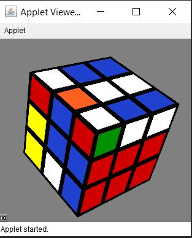
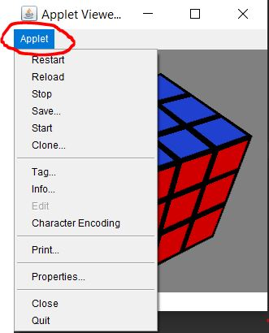
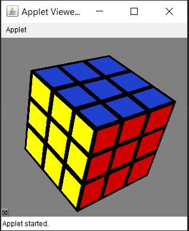

# Rubiks3D-Java-Swing

## Description

This project is developed by __Milan Bhuva__. 
The project consists of a GUI application of a regular 3x3x3 Rubik's cube coded in __Java Swing__. The application allows the user to interact freely with the cube by changing camera angles and using the different functionalities provided in the drop-down menu.

## Features Of The Cube
 

 
 
 
 

### Clicking on Applet: 
 

 
 
 
 

### After clicking on Restart
 

